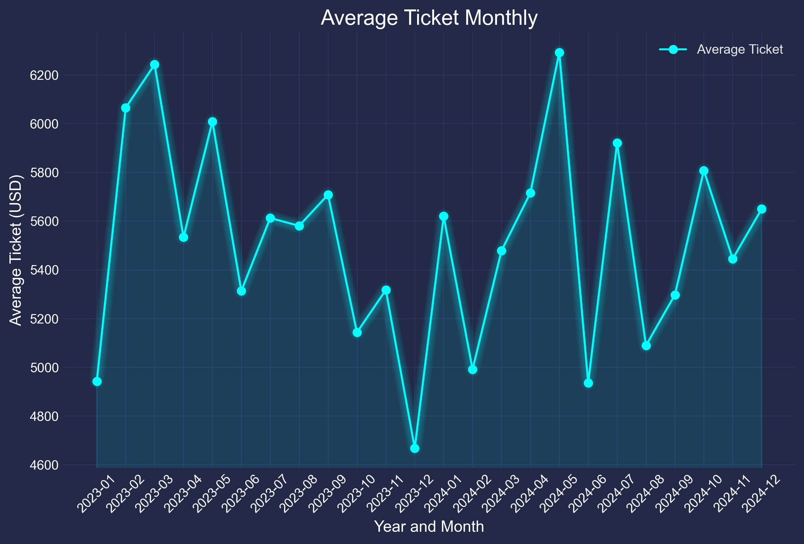
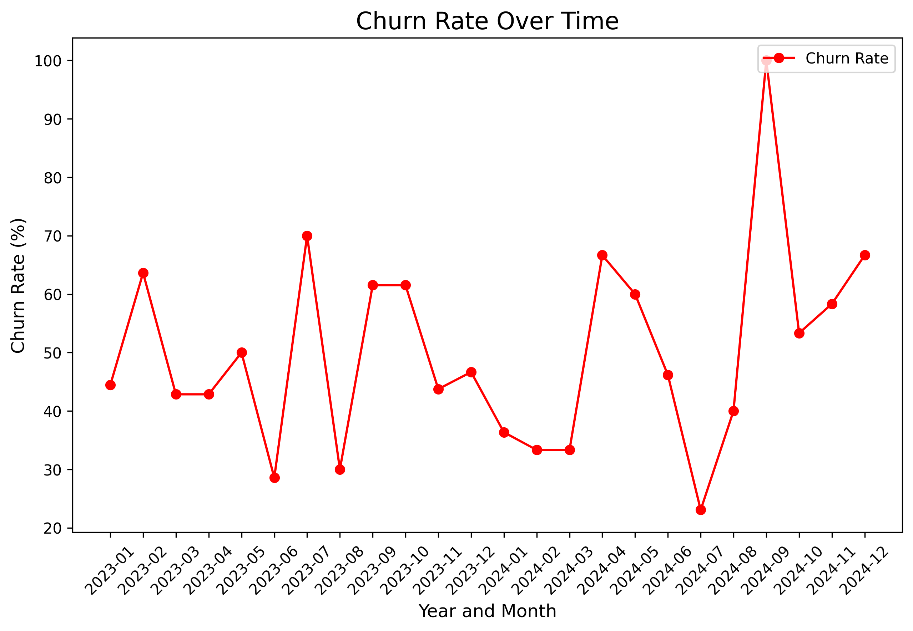
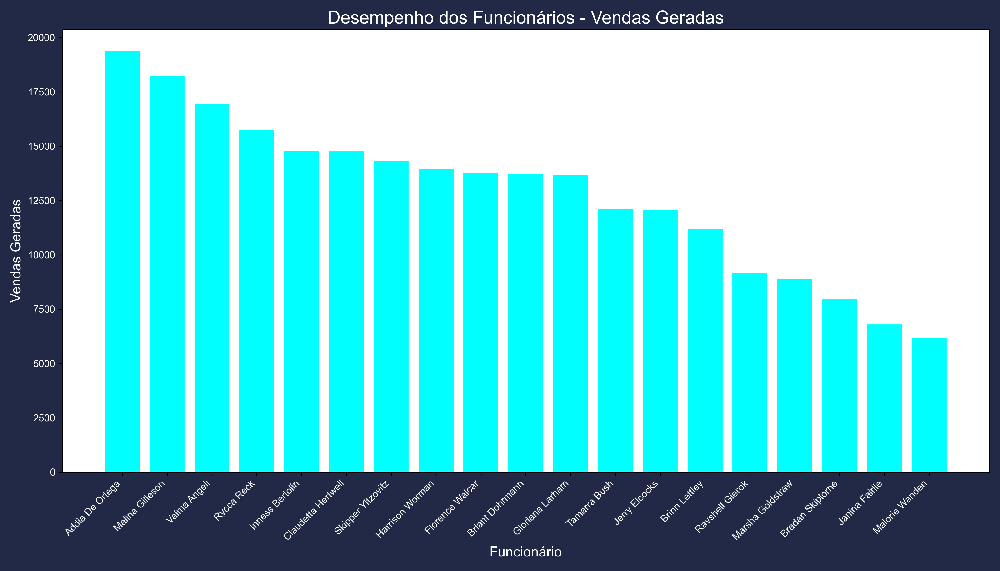
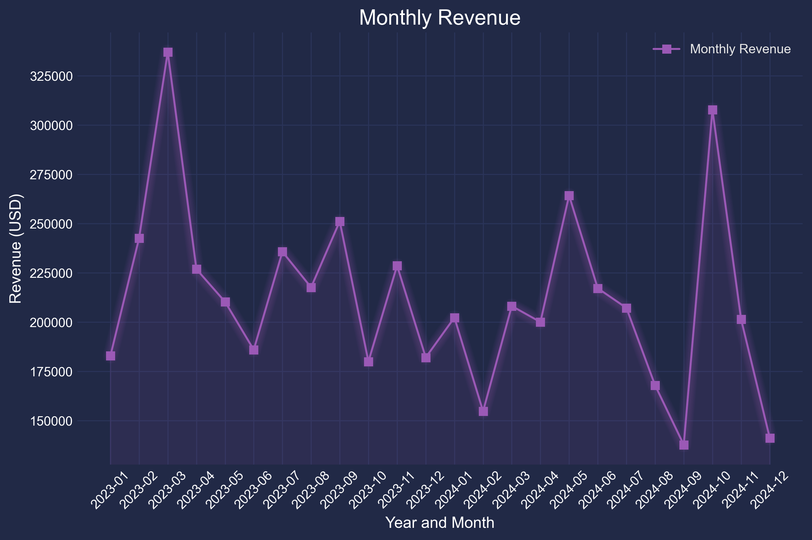

# Estrutura do Projeto

Este repositório contém scripts e dados para processamento e análise de informações relacionadas a clientes, funcionários e vendas. A seguir, está a organização das pastas e arquivos:

## Apresentação dos Gráficos

Os gráficos gerados pelos scripts foram consolidados em um arquivo PDF chamado **`presentation_of_graphics.pdf`**, que apresenta de forma clara e visual os principais insights extraídos dos dados. 

O documento inclui:
- **Ticket Médio Mensal**: Evidencia tendências nos valores das vendas ao longo do tempo.
- **Taxa de Churn**: Destaca períodos críticos de perda de clientes e sua evolução.
- **Desempenho dos Funcionários**: Identifica os maiores geradores de vendas e auxilia na avaliação de performance.
- **Faturamento Mensal**: Mostra a evolução das receitas, permitindo análises de sazonalidade e crescimento.

Essa apresentação é ideal para comunicar os resultados a stakeholders, facilitando a tomada de decisões estratégicas com base nos dados analisados.


## Estrutura de Pastas e Arquivos

### Diretório Principal
- `README.md`: Documentação do projeto.
- `clean.py`: Script Python para limpeza e validação dos dados.
- `avarage_ticket.py`: Script para calcular e visualizar o ticket médio mensal.
- `churn_rate.py`: Script para calcular e visualizar a taxa de churn.
- `employee_performance.py`: Script para analisar e visualizar o desempenho dos funcionários.
- `faturamento_mes.py`: Script para calcular e visualizar o faturamento mensal.
- `presentation of graphics.pdf`: Apresentação dos dados.

### Pasta `data`
Contém os arquivos de dados brutos:
- `Customers.csv`: Informações sobre clientes com as seguintes colunas:
  - `CustomerID`: Identificador único do cliente.
  - `Name`: Nome do cliente.
  - `SignupDate`: Data de cadastro.
  - `LastPurchaseDate`: Data da última compra.
  - `Status`: Status do cliente (ex.: Ativo, Inativo, Pendente).
- `Employees.csv`: Dados dos funcionários com as seguintes colunas:
  - `EmployeeID`: Identificador único do funcionário.
  - `Name`: Nome do funcionário.
  - `Department`: Departamento do funcionário.
  - `TasksCompleted`: Tarefas concluídas pelo funcionário.
  - `SalesGenerated`: Vendas geradas pelo funcionário.
  - `PerformanceScore`: Nota de desempenho.
- `Sales.csv`: Dados das vendas realizadas com as seguintes colunas:
  - `SaleID`: Identificador único da venda.
  - `CustomerID`: Identificador do cliente relacionado à venda.
  - `EmployeeID`: Identificador do funcionário relacionado à venda.
  - `SaleDate`: Data da venda.
  - `Amount`: Valor da venda.

### Pasta `clean_data`
Contém os arquivos de dados limpos gerados após a execução de `clean.py`. Esta pasta é criada automaticamente, se não existir.
- `Clean_Customers.csv`: Versão limpa de `Customers.csv`.
- `Clean_Employees.csv`: Versão limpa de `Employees.csv`.
- `Clean_Sales.csv`: Versão limpa de `Sales.csv`.

### Pasta `charts`
Armazena os gráficos gerados pelos scripts de análise. Esta pasta é criada automaticamente, se não existir.
- Exemplos de gráficos:
  - `Average_Ticket_Monthly.png`: Gráfico do ticket médio mensal.
  - `Churn_Rate.png`: Gráfico da taxa de churn ao longo do tempo.
  - `Employee_Performance.png`: Gráfico de desempenho dos funcionários.
  - `Monthly_Revenue.png`: Gráfico de faturamento mensal.

## Scripts de Análise

### `avarage_ticket.py`
Calcula e visualiza o ticket médio mensal com base nos dados de vendas:
- Carrega os dados de `Clean_Sales.csv`.
- Calcula a média mensal de `Amount`.
- Gera um gráfico estilizado com tema Cyberpunk.
- Salva o gráfico em `charts/Average_Ticket_Monthly.png`.


### `churn_rate.py`
Calcula e visualiza a taxa de churn (clientes inativos):
- Carrega os dados de `Clean_Customers.csv`.
- Filtra clientes com status "Inativo".
- Calcula a taxa de churn mensal.
- Gera um gráfico com fundo branco para facilitar a leitura.
- Salva o gráfico em `charts/Churn_Rate.png`.


### `employee_performance.py`
Analisa e visualiza o desempenho dos funcionários:
- Carrega os dados de `Clean_Employees.csv`.
- Ordena os funcionários pelo total de vendas geradas.
- Gera um gráfico de barras estilizado com tema Cyberpunk.
- Salva o gráfico em `charts/Employee_Performance.png`.


### `faturamento_mes.py`
Calcula e visualiza o faturamento mensal:
- Carrega os dados de `Clean_Sales.csv`.
- Agrupa os dados por mês e calcula o faturamento total.
- Gera um gráfico estilizado com tema Cyberpunk.
- Salva o gráfico em `charts/Monthly_Revenue.png`.


## Instale as dependências

```bash
pip install mplcyberpunk
```

```bash
pip install pandas
```


## Executando os Scripts

Certifique-se de que os dados limpos estejam na pasta `clean_data`. Execute cada script separadamente para gerar os gráficos correspondentes. Exemplos de comandos:

```bash
python clean.py
python avarage_ticket.py
python churn_rate.py
python employee_performance.py
python faturamento_mes.py
```

Os gráficos serão salvos na pasta `charts`.


